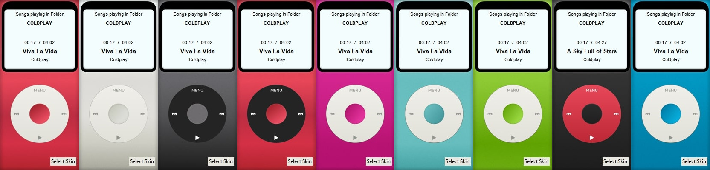

**iPod-iReminiscentPlayer**
A lightweight music player with 9 iPod-inspired skins, built with Python and Tkinter, supporting various audio formats (MP3, WAV, FLAC).

Key Features:

- Play, pause, and skip tracks
- Display song metadata (title, artist, album)
- Auto-Load and save playlist settings
- Playlist management (In works)

Requirements:

- Python 3.x
- Tkinter
- Mutagen
- Pillow
- Custom Tkinter (In works)

Usage:

1. Clone the repository
2. Run python main.py
3. Select a music folder using the "Menu" button

Attribution:
**iPod is a trademark of Apple Inc. This project is not affiliated with or endorsed by Apple Inc.**

Images:
- IPOD Skins: https://wallpapercg.com/ipod-for-iphone-wallpapers
- Buttons: <a href="https://www.flaticon.com/free-icons/next-song" title="next song icons">Song Multimedia icons created by little_dipper_studio - Flaticon</a>
  - Author: <a href="https://www.flaticon.com/authors/little-dipper-studio">little_dipper_studio - Flaticon</a>
  - Pack: <a href="https://www.flaticon.com/packs/media-player-buttons-13481041">Multimedia Icons Pack - Flaticon</a>

Screenshots:
- Skin: 
